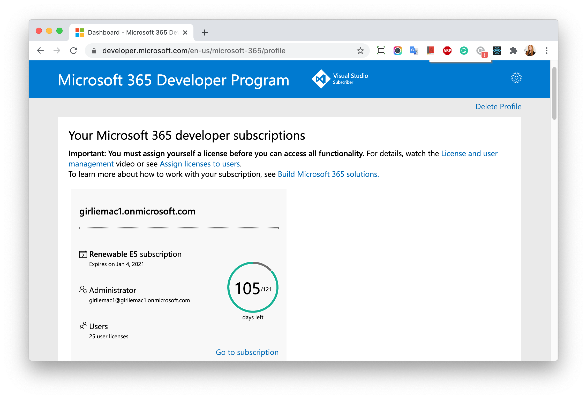
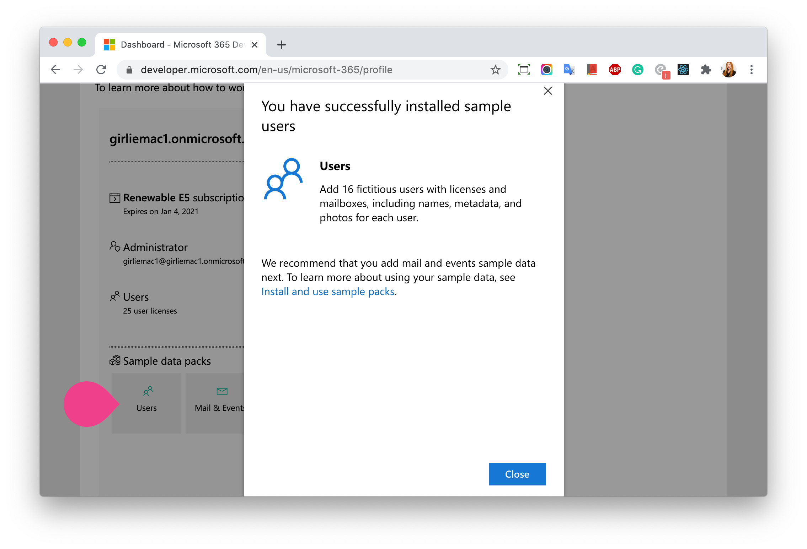
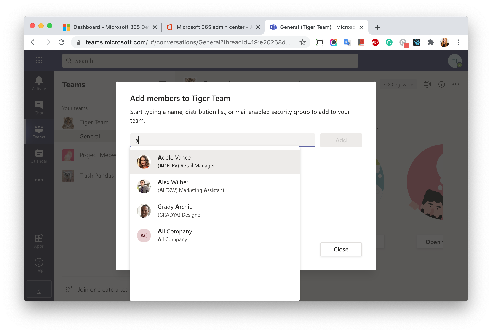
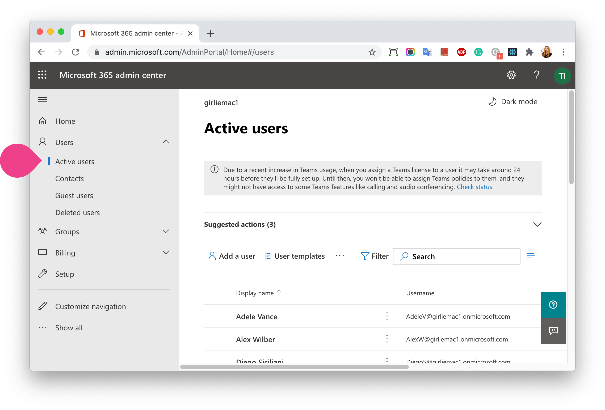

# Sigining up for the M365 Developer Membership

Even if you are not a part of the Microsoft Office subscription, you can apply for a free M365 Dev account to develop on MS Teams.

It is up to you to decide to upgrade your service, or use other Microsoft services, for example, hosting your apps, or store data in the database on Azure, etc. with the separated subscription.

## ✍️ Sigining up for the developer account

Go to [Microsoft 365 developer subscriptions](https://developer.microsoft.com/en-us/microsoft-365/dev-program) and sign up.

Once you signed up, you are taken to [Microsoft 365 Developer Program dashboard](https://developer.microsoft.com/office/profile). 

You can use the assigned email address (something like `girliemac1@girliemac1.onmicrosoft.com`) to sign in on [Teams](https://teams.microsoft.com/) to start using the client.

## 👨‍👩‍👧‍👦 Adding fictional users 

You can add fake users with the user data to test your app, especially Graph API.

Click the **Users** box under **Sample Data Packs** in your dashboard to install.

You can invite them in your Teams channels too.

To view the user details, go to [Microsoft 365 Admin Center](https://admin.microsoft.com/Adminportal/Home#/users) > **Users**.

Now you can start building your apps!